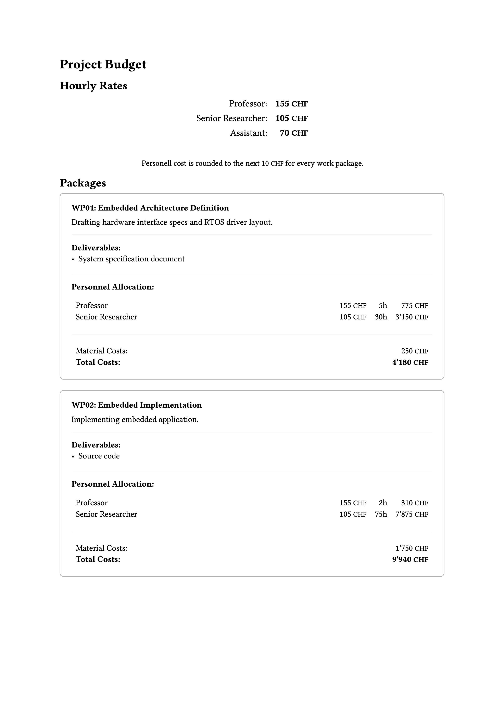

# work-packages

A clean Typst package for managing engineering proposals, academic grant applications, and commercial offers. 
Define work packages with role-based hours and material budgets, and render aggregate cost tables automatically.




## Installation

Clone this repository directly into your local Typst package directory:

### macOS

```bash
mkdir -p "$HOME/Library/Application Support/typst/packages/local/work-packages"
git clone https://github.com/cm0x4D/Typst-work-package.git "$HOME/Library/Application Support/typst/packages/local/work-packages/0.1.0"
```

### Linux

```bash
mkdir -p "${XDG_DATA_HOME:-$HOME/.local/share}/typst/packages/local/work-packages"
git clone https://github.com/cm0x4D/Typst-work-package.git "${XDG_DATA_HOME:-$HOME/.local/share}/typst/packages/local/work-packages/0.1.0"
```

### Windows

**PowerShell:**
```powershell
New-Item -ItemType Directory -Path "$env:APPDATA\typst\packages\local\work-packages" -Force
git clone https://github.com/cm0x4D/Typst-work-package.git "$env:APPDATA\typst\packages\local\work-packages\0.1.0"
```

**Command Prompt:**
```cmd
if not exist "%APPDATA%\typst\packages\local\work-packages" mkdir "%APPDATA%\typst\packages\local\work-packages"
git clone https://github.com/cm0x4D/Typst-work-package.git "%APPDATA%\typst\packages\local\work-packages\0.1.0"
```

## Usage

```typst
#import "@local/work-packages:0.1.0" as wp

#wp.setup(
  currency: "CHF",
  rates: (
    "Professor": 155,
    "Senior Researcher": 105,
    "Assistant": 70,
  ),
  thousand-seperator: "'",
  digits: 0,
  round: 10
)

= Project Budget

== Hourly Rates

#wp.hourly-rates()

== Packages

#wp.work-package(
  "Embedded Architecture Definition",
  description: [Drafting hardware interface specs and RTOS driver layout.],
  hours: (
    "Professor": 5,
    "Senior Researcher": 30,
  ),
  materials: 250,
  deliverables: (
    "System specification document",
  ),
)

#wp.work-package(
  "Embedded Implementation",
  description: [Implementing embedded application.],
  hours: (
    "Professor": 2,
    "Senior Researcher": 75,
  ),
  materials: 1750,
  deliverables: (
    "Source code",
  ),
)

#pagebreak()

== Summary

#wp.summary(
    discount: 1000,
    round: 1000
)
```
